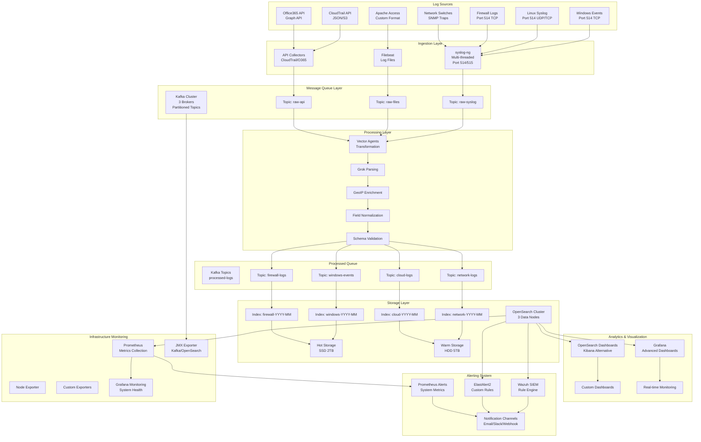

#### Argus monitoring
Dataflow

```mermaid
flowchart TB
    subgraph Sources["Log Sources"]
        A1["Windows Events<br/>Port 514 TCP"]
        A2["Linux Syslog<br/>Port 514 UDP/TCP"]
        A3["Firewall Logs<br/>Port 514 TCP"]
        A4["Network Switches<br/>SNMP Traps"]
        A5["CloudTrail API<br/>JSON/S3"]
        A6["Office365 API<br/>Graph API"]
        A7["Apache Access<br/>Custom Format"]
    end

    subgraph Ingestion["Ingestion Layer"]
        B1["syslog-ng<br/>Multi-threaded<br/>Port 514/515"]
        B2["Filebeat<br/>Log Files"]
        B3["API Collectors<br/>CloudTrail/O365"]
    end

    subgraph MessageQueue["Message Queue Layer"]
        C1["Kafka Cluster<br/>3 Brokers<br/>Partitioned Topics"]
        C2["Topic: raw-syslog"]
        C3["Topic: raw-files"]
        C4["Topic: raw-api"]
    end

    subgraph Processing["Processing Layer"]
        D1["Vector Agents<br/>Transformation"]
        D2["Grok Parsing"]
        D3["GeoIP Enrichment"]
        D4["Field Normalization"]
        D5["Schema Validation"]
    end

    subgraph ProcessedQueue["Processed Queue"]
        E1["Kafka Topics<br/>processed-logs"]
        E2["Topic: windows-events"]
        E3["Topic: firewall-logs"]
        E4["Topic: network-logs"]
        E5["Topic: cloud-logs"]
    end

    subgraph Storage["Storage Layer"]
        F1["OpenSearch Cluster<br/>3 Data Nodes"]
        F2["Index: windows-YYYY-MM"]
        F3["Index: firewall-YYYY-MM"]
        F4["Index: network-YYYY-MM"]
        F5["Index: cloud-YYYY-MM"]
        F6["Hot Storage<br/>SSD 2TB"]
        F7["Warm Storage<br/>HDD 5TB"]
    end

    subgraph Analytics["Analytics & Visualization"]
        G1["OpenSearch Dashboards<br/>Kibana Alternative"]
        G2["Grafana<br/>Advanced Dashboards"]
        G3["Custom Dashboards"]
        G4["Real-time Monitoring"]
    end

    subgraph Alerting["Alerting System"]
        H1["Wazuh SIEM<br/>Rule Engine"]
        H2["ElastAlert2<br/>Custom Rules"]
        H3["Prometheus Alerts<br/>System Metrics"]
        H4["Notification Channels<br/>Email/Slack/Webhook"]
    end

    subgraph Monitoring["Infrastructure Monitoring"]
        I1["Prometheus<br/>Metrics Collection"]
        I2["Node Exporter"]
        I3["JMX Exporter<br/>Kafka/OpenSearch"]
        I4["Custom Exporters"]
        I5["Grafana Monitoring<br/>System Health"]
    end

    A1 --> B1
    A2 --> B1
    A3 --> B1
    A4 --> B1
    A5 --> B3
    A6 --> B3
    A7 --> B2

    B1 --> C2
    B2 --> C3
    B3 --> C4

    C2 --> D1
    C3 --> D1
    C4 --> D1

    D1 --> D2
    D2 --> D3
    D3 --> D4
    D4 --> D5

    D5 --> E2
    D5 --> E3
    D5 --> E4
    D5 --> E5

    E2 --> F2
    E3 --> F3
    E4 --> F4
    E5 --> F5

    F2 --> F6
    F3 --> F6
    F4 --> F7
    F5 --> F7

    F1 --> G1
    F1 --> G2
    G1 --> G3
    G2 --> G4

    F1 --> H1
    F1 --> H2
    I1 --> H3
    H1 --> H4
    H2 --> H4
    H3 --> H4

    F1 --> I1
    C1 --> I3
    I1 --> I5
```
